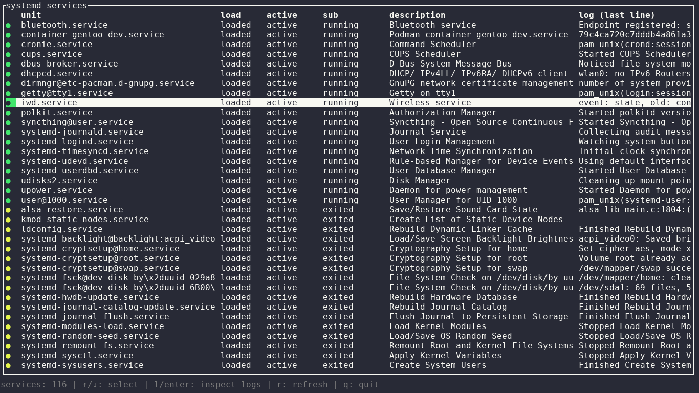

<!-- Copyright (c) 2026 l5yth -->
<!-- SPDX-License-Identifier: Apache-2.0 -->

# lsu

`lsu` is a Rust terminal UI for viewing `systemd` service units and their latest log line.



## Dependencies

- Linux system with `systemd`
- `systemctl` and `journalctl` available in `PATH`
- Rust toolchain (Rust 2021 edition, Cargo)

Core crates: `ratatui`, `crossterm`, `serde`, `serde_json`, `anyhow`.

## Installation

Build from source:

```bash
git clone <repo-url>
cd lsu
cargo build --release
```

Run the built binary:

```bash
./target/release/lsu
```

Or run directly in development:

```bash
cargo run --
```

## Usage

```text
Usage: lsu [OPTIONS]

Show systemd services in a terminal UI.

Options:
  -a, --all            Shorthand for --load all --active all --sub all
      --load <value>   Filter by load state (e.g. loaded, not-found, masked, all)
      --active <value> Filter by active state (e.g. active, inactive, failed, all)
      --sub <value>    Filter by sub state (e.g. running, exited, dead, all)
  -r, --refresh <num>  Auto-refresh interval in seconds (0 disables, default: 0)
  -h, --help           Show this help text
```

Examples:

```bash
lsu
lsu --all
lsu --all --refresh 5
lsu -r 0
```

In-app keys:

- `q`: quit
- `r`: refresh now

## Development

```bash
cargo check
cargo test
cargo fmt --all
cargo clippy --all-targets --all-features -D warnings
```
